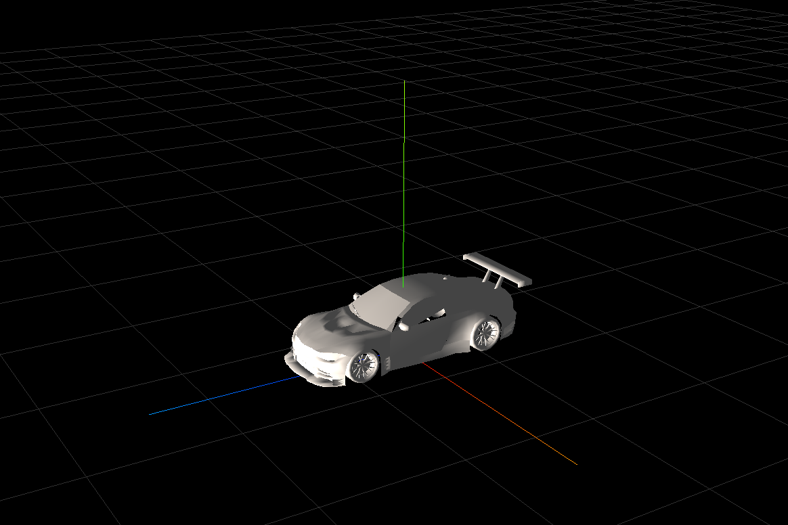

# 3D File Editor Component for Angular 2



#### Install
$ npm install --save ng2-ed-editor

#### Basic usage 

```html
<threed-viewer [urlFile]="'filename.obj'"></threed-viewer>
```

[Live Demo](https://plnkr.co/edit/I4lIyA?p=preview)

Example of an App that declares the file viewer component :

```ts
 import { Component, NgModule } from '@angular/core';
 import { BrowserModule } from '@angular/platform-browser';
 import { Editor3DModule } from 'ng2-3d-editor';
 import { CommonModule } from '@angular/common';
 import {platformBrowserDynamic} from '@angular/platform-browser-dynamic';

 @Component({
   selector: 'my-app',
   template: `
      <threed-viewer [urlFile]="'https://cdn.rawgit.com/eromano/ng2-3d-editor/master/examples/obj/car/car.obj'" ></threed-viewer>
   `,
 })
 export class App {
  
   constructor() {
     console.log('start');
   }
 }
 
 @NgModule({
   imports: [
     CommonModule,
     BrowserModule,
     Editor3DModule.forRoot()
   ],
   declarations: [ App ],
   bootstrap: [ App ]
 })
 export class AppModule {}

platformBrowserDynamic().bootstrapModule(AppModule);
```

#### Options

Attribute     | Options     | Default      | Description | Mandatory
---           | ---         | ---          | ---         | ---
`urlFile`         | *string*    |        |  Url 3D file to load | 
`initialPositionCamera`         | *Object*    |        |   If you want change  the initial camera position pass an object ```ts{x:xvalue , y:yvalue , z:zvalue}```| 
`initialRotationCamera`         | *Object*    |        |   If you want change  the initial camera rotation  pass an object ```ts{x:xvalue , y:yvalue , z:zvalue}```| 
`clearColor`         | *Hexadecimal color*    |        |   Sets the clear color | 

#### Supported file formats

Type     | extensions     
---           | ---         
3D         | OBJ


## Build from sources

Alternatively you can build component from sources with the following commands:


```sh
npm install
npm run build
```

### Build the files and keep watching for changes

```sh
$ npm run build:w
```

## Running unit tests

```sh
npm test
```

### Running unit tests in browser

```sh
npm test-browser
```

This task rebuilds all the code, runs tslint, license checks and other quality check tools
before performing unit testing.

### Code coverage

```sh
npm run coverage
```

## Demo

If you want have a demo of how the component works, please check the demo folder :

```sh
cd demo
npm install
npm start
```

## NPM scripts

| Command | Description |
| --- | --- |
| npm run build | Build component |
| npm run build:w | Build component and keep watching the changes |
| npm run test | Run unit tests in the console |
| npm run test-browser | Run unit tests in the browser
| npm run coverage | Run unit tests and display code coverage report |

License:

ng2-3d-editror is shared under the Apache Version 2.0. Please give this the Github repo a ⭐️ .

